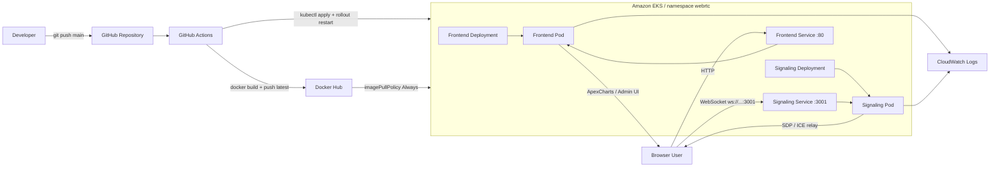
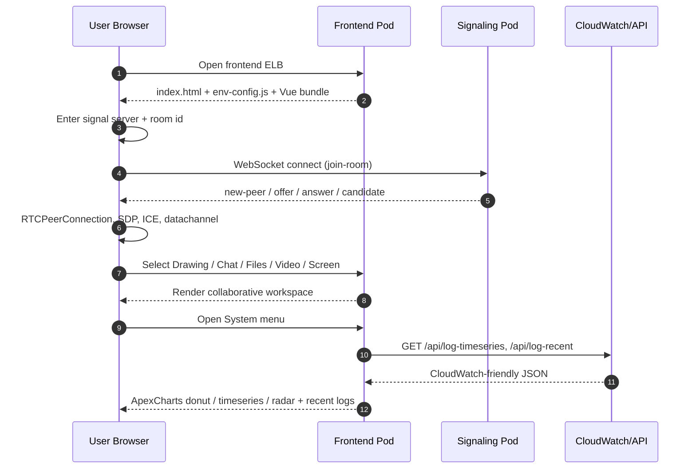

# Docker Advanced WebRTC Vue

Vue 3 기반 협업형 WebRTC 애플리케이션입니다.  
프런트엔드와 시그널링 서버가 각각 독립된 컨테이너로 동작하며, Docker Compose로 로컬에서 한 번에 실행할 수 있습니다.

---

## 기술 스택

### Frontend

| 분류 | 기술 | 버전 | 역할 |
|------|------|------|------|
| UI Framework | **Vue 3** | ^3.5 | Composition API 기반 컴포넌트 트리 |
| Build Tool | **Vite** | ^7.1 | ESM 번들링, HMR, 환경변수 주입 |
| Styling | **Tailwind CSS** | ^3.4 | 유틸리티 클래스 + 커스텀 CSS 변수 |
| CSS Post-processing | **PostCSS** + autoprefixer | - | Tailwind 트랜스파일 및 벤더 접두사 |
| Chart Library | **ApexCharts** (vue3-apexcharts) | ^5.3 | 운영 대시보드: 도넛·타임시리즈·레이더 차트 |
| Runtime Server | **Node.js HTTP** (frontend-server.cjs) | 20.x | `dist/` 정적 파일 서빙 + `/env-config.js` 런타임 주입 |

**핵심 설계 포인트**

- `VITE_SIGNAL_URL`은 빌드 타임이 아닌 **런타임**에 주입됩니다.  
  `frontend-server.cjs`가 컨테이너 시작 시 `window.__APP_CONFIG__`를 `env-config.js`로 브라우저에 전달하므로, 이미지를 재빌드하지 않고 환경변수만 바꿔 signaling 주소를 변경할 수 있습니다.
- `src/utils/signalUrl.js`는 수동 입력 → 런타임 env → 빌드타임 env → `window.location.hostname:PORT` 순서로 WebSocket URL을 결정합니다.

### Signaling Server

| 분류 | 기술 | 버전 | 역할 |
|------|------|------|------|
| Runtime | **Node.js** | 20.x (Alpine) | CommonJS 기반 단일 파일 서버 |
| WebSocket | **ws** | ^8.19 | RFC 6455 WebSocket 서버 구현 |
| Protocol | HTTP + WebSocket 동일 포트 | - | `/health` 헬스체크 + WebSocket upgrade 처리 |

**시그널링 흐름**

1. 클라이언트가 `join-room` 메시지 전송 → 서버가 같은 방의 다른 피어에게 `new-peer` 전파
2. 이후 SDP offer/answer, ICE candidate를 방 전체에 relay (브로드캐스트)
3. 피어 퇴장 시 `peer-left` 전파 후 방이 비면 자동 삭제

### WebRTC (브라우저 네이티브)

| API | 용도 |
|-----|------|
| `RTCPeerConnection` | P2P 미디어·데이터 채널 연결 |
| `RTCDataChannel` | 텍스트 채팅, 파일 전송, 화이트보드 드로잉 동기화 |
| `getUserMedia` | 카메라 스트림 캡처 |
| `getDisplayMedia` | 화면 공유 캡처 |
| `MediaStream` | 원격 스트림 렌더링 |

### DevOps / Infra

| 분류 | 기술 | 역할 |
|------|------|------|
| 컨테이너 | **Docker** + Docker Compose | 멀티 서비스 로컬 실행 |
| 베이스 이미지 | `node:20-alpine` | 경량 프로덕션 이미지 |
| 멀티스테이지 빌드 | Dockerfile.frontend | 빌드 의존성을 최종 이미지에서 제거 |
| CI/CD | **GitHub Actions** | Docker Hub push + EKS rollout |
| 컨테이너 레지스트리 | **Docker Hub** | `edumgt/webrtc-frontend:latest`, `edumgt/webrtc-signaling:latest` |
| 오케스트레이션 | **Amazon EKS** (Kubernetes) | namespace `webrtc` 안에 frontend/signaling deployment |
| 모니터링 | **CloudWatch Logs** | System 메뉴 차트 데이터 소스 (API 폴백: 브라우저 수집 로그) |

### 테스트

| 도구 | 용도 |
|------|------|
| **Playwright** (@playwright/test ^1.52) | E2E 화면 캡처, README 스크린샷 자동 생성 |

---

## 프로젝트 구조

```
webrtc-app/
├── signaling/                   # 시그널링 서버
│   ├── server.cjs               # HTTP + WebSocket (프로덕션)
│   ├── signal.js                # 심플 WebSocket only (개발용)
│   └── package.json             # 의존성: ws
│
├── frontend/                    # Vue 3 앱 + 정적 서버
│   ├── src/
│   │   ├── App.vue              # 루트 컴포넌트 (좌우 offcanvas 레이아웃)
│   │   ├── composables/
│   │   │   └── useWebRTC.js     # WebRTC 상태·이벤트 통합 composable
│   │   ├── components/
│   │   │   ├── Whiteboard.vue   # 공유 드로잉 캔버스
│   │   │   ├── ChatBox.vue      # 실시간 채팅
│   │   │   ├── FileBox.vue      # 파일 전송
│   │   │   ├── MediaPanel.vue   # 카메라·화면 공유
│   │   │   ├── Video.vue        # 단일 비디오 스트림
│   │   │   └── SystemPanel.vue  # 운영 대시보드
│   │   └── utils/
│   │       └── signalUrl.js     # WebSocket URL 결정 로직
│   ├── index.html
│   ├── vite.config.js
│   ├── tailwind.config.js
│   ├── postcss.config.js
│   ├── frontend-server.cjs      # 정적 파일 서버 (런타임 env 주입)
│   └── package.json             # 의존성: Vue, Vite, Tailwind, ApexCharts
│
├── Dockerfile.signaling         # node:20-alpine 단일 스테이지
├── Dockerfile.frontend          # node:20-alpine 멀티스테이지 (빌드 + 서빙)
├── docker-compose.yml           # 로컬 실행 (포트 8480/8481)
├── .env                         # 환경변수 (로컬 기본값)
├── .env.example                 # 환경변수 가이드
├── .dockerignore
├── nginx.conf                   # 레거시 참고용 (현재 미사용)
├── kube-manifests/              # EKS 배포 매니페스트
└── .github/workflows/           # GitHub Actions CI/CD
```

---

## 로컬 Docker 실행

```bash
# 이미지 빌드 후 컨테이너 시작
docker compose up --build

# 백그라운드 실행
docker compose up --build -d
```

| 서비스 | URL |
|--------|-----|
| 프런트엔드 | http://localhost:8480 |
| 시그널링 | ws://localhost:8481 |

> 포트 8480 / 8481은 일반적으로 사용하는 80, 3001, 8080과 겹치지 않아 로컬 충돌을 방지합니다.

---

## 환경변수

`.env` 파일로 설정합니다.

```env
# 브라우저가 접속하는 시그널링 호스트 포트 (docker-compose 매핑 포트와 일치)
VITE_SIGNAL_URL=
VITE_SIGNAL_PORT=8481

# 프런트엔드 컨테이너 내부 포트
FRONTEND_HOST=0.0.0.0
FRONTEND_PORT=80

# 시그널링 컨테이너 내부 포트
SIGNAL_HOST=0.0.0.0
SIGNAL_PORT=3001
```

AWS 배포 시 `VITE_SIGNAL_URL`에 ELB 주소를 설정합니다:

```env
VITE_SIGNAL_URL=wss://your-load-balancer.ap-northeast-2.elb.amazonaws.com
```

---

## 로컬 개발 (Docker 없이)

```bash
cd frontend
npm install
npm run dev          # Vite dev server (포트 5173)

# 별도 터미널
cd signaling
npm install
npm start            # 시그널링 서버 (포트 3001)
```

WSL에서 외부 접속 허용:

```bash
cd frontend
npm run dev:wsl
```

---

## System Flow



## Sequence Diagram



---

## CloudWatch 차트 연동

System 메뉴는 아래 API 포맷을 기대합니다. API가 없을 경우 브라우저 수집 로그로 폴백합니다.

- `GET /api/log-timeseries?rangeMinutes=60&binMinutes=5`
- `GET /api/log-recent?limit=20`

```json
{
  "rangeMinutes": 60,
  "binMinutes": 5,
  "series": [
    {
      "name": "frontend_errors",
      "data": [["2026-04-10T10:00:00Z", 3], ["2026-04-10T10:05:00Z", 1]]
    }
  ],
  "recentLogs": [
    {
      "timestamp": "2026-04-10T10:12:10Z",
      "service": "signaling",
      "level": "error",
      "event": "websocket_connect_failed",
      "message": "timeout"
    }
  ]
}
```

---

## Key Files

| 파일 | 설명 |
|------|------|
| [`frontend/src/App.vue`](./frontend/src/App.vue) | 루트 컴포넌트, 좌우 offcanvas 레이아웃 |
| [`frontend/src/composables/useWebRTC.js`](./frontend/src/composables/useWebRTC.js) | WebRTC 전체 상태 관리 |
| [`frontend/src/components/Whiteboard.vue`](./frontend/src/components/Whiteboard.vue) | 공유 드로잉 |
| [`frontend/src/components/SystemPanel.vue`](./frontend/src/components/SystemPanel.vue) | 운영 대시보드 |
| [`frontend/frontend-server.cjs`](./frontend/frontend-server.cjs) | 런타임 env 주입 정적 서버 |
| [`signaling/server.cjs`](./signaling/server.cjs) | WebSocket 시그널링 서버 |
| [`Dockerfile.frontend`](./Dockerfile.frontend) | 멀티스테이지 프런트엔드 이미지 |
| [`Dockerfile.signaling`](./Dockerfile.signaling) | 시그널링 이미지 |
| [`docker-compose.yml`](./docker-compose.yml) | 로컬 실행 구성 |
| [`kube-manifests/`](./kube-manifests/) | EKS 배포 매니페스트 |
